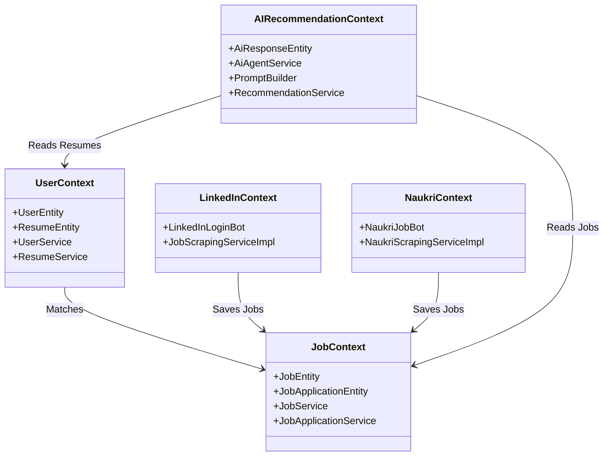
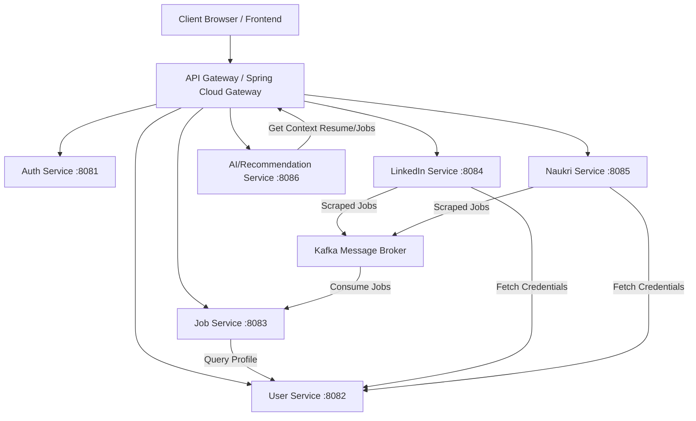
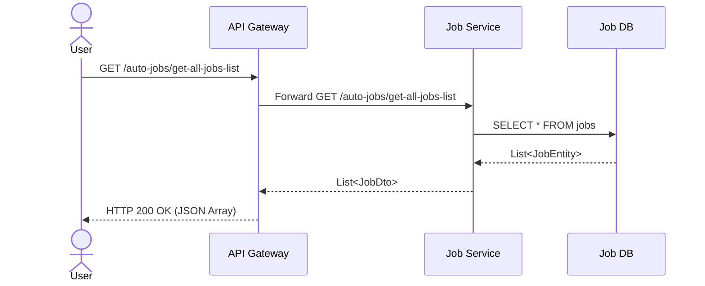
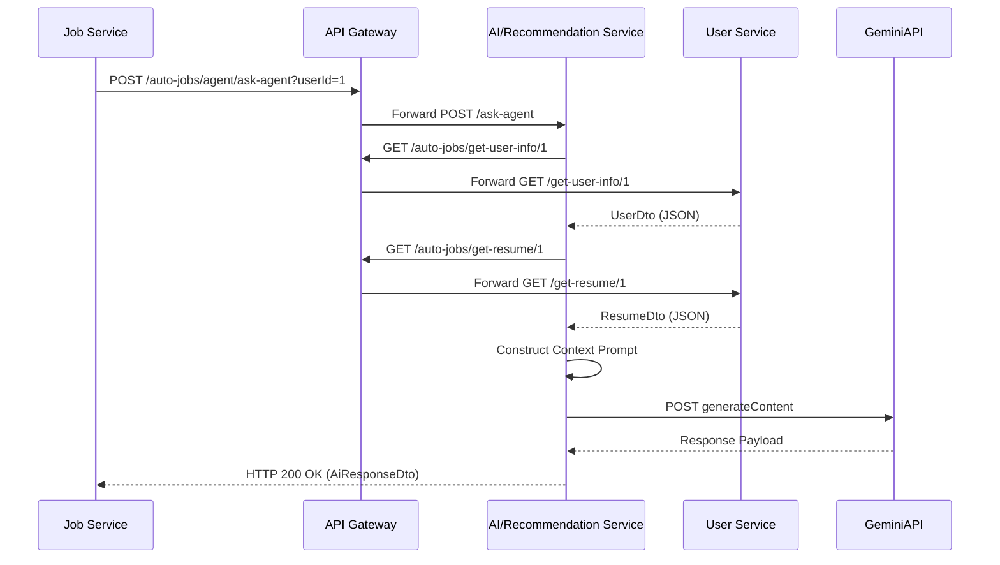
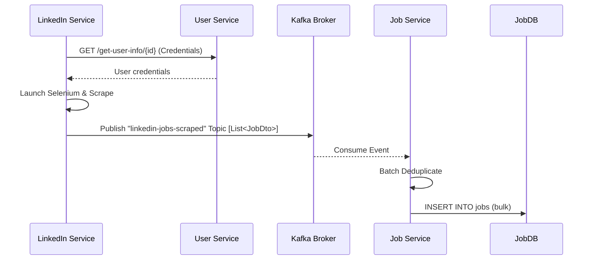
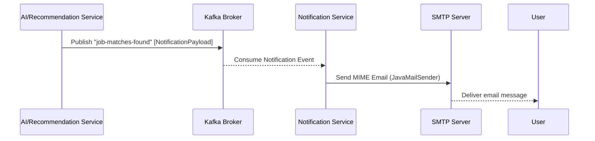
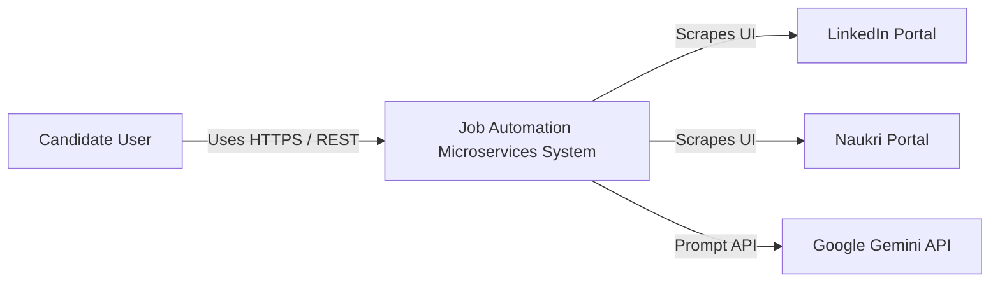
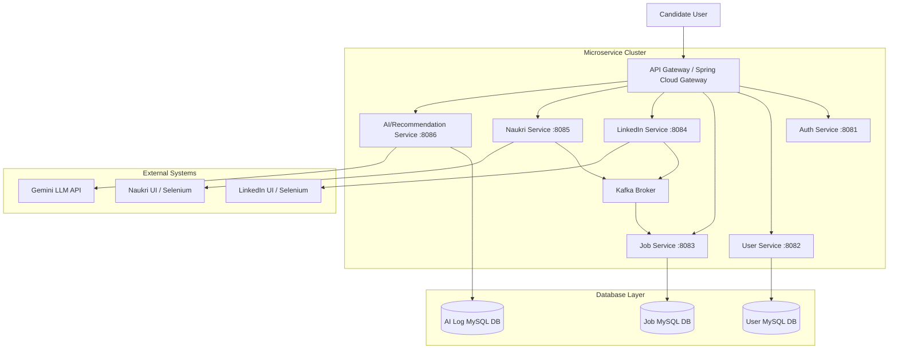
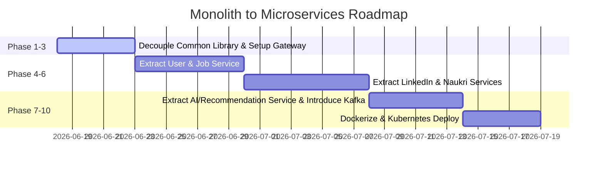

# Microservices Migration Plan: Monolith to Bounded Contexts

This document presents a comprehensive, production-grade architecture design and migration plan to split the `Linked_and_Naukari_jobs_Spring_boot_Automation_Services` monolithic codebase into six independent microservices, a common library, and an API Gateway.

---

## Phase 1: Repository Analysis

### 1. Monolithic Component Inventory
The current codebase is a single-module Spring Boot application configured in [pom.xml](file:///e:/AngularProjects/Job_Automation_with_Spring_boot/Linked_and_Naukri%20_jobs_Spring_boot_Automation_Services/pom.xml). It contains the following packages and classes:

*   **Application Boot**:
    *   [LinkedJobsSpringBootAutomationServicesApplication.java](file:///e:/AngularProjects/Job_Automation_with_Spring_boot/Linked_and_Naukri%20_jobs_Spring_boot_Automation_Services/src/main/java/com/Linked_jobs_Spring_boot_Automation_Services/LinkedJobsSpringBootAutomationServicesApplication.java): Standard `@SpringBootApplication` scanning `com.jobbot` and `com.Linked_jobs_Spring_boot_Automation_Services`.
*   **Controllers (`com.jobbot.controller`)**:
    *   [UserController.java](file:///e:/AngularProjects/Job_Automation_with_Spring_boot/Linked_and_Naukri%20_jobs_Spring_boot_Automation_Services/src/main/java/com/jobbot/controller/UserController.java): Manages user profiles.
    *   [ResumeController.java](file:///e:/AngularProjects/Job_Automation_with_Spring_boot/Linked_and_Naukri%20_jobs_Spring_boot_Automation_Services/src/main/java/com/jobbot/controller/ResumeController.java): Updates resume files.
    *   [JobController.java](file:///e:/AngularProjects/Job_Automation_with_Spring_boot/Linked_and_Naukri%20_jobs_Spring_boot_Automation_Services/src/main/java/com/jobbot/controller/JobController.java): Job list CRUD operations.
    *   [AutomationController.java](file:///e:/AngularProjects/Job_Automation_with_Spring_boot/Linked_and_Naukri%20_jobs_Spring_boot_Automation_Services/src/main/java/com/jobbot/controller/AutomationController.java): Main entry point triggering LinkedIn/Naukri Selenium scrapers.
    *   [ApplyJobController.java](file:///e:/AngularProjects/Job_Automation_with_Spring_boot/Linked_and_Naukri%20_jobs_Spring_boot_Automation_Services/src/main/java/com/jobbot/controller/ApplyJobController.java): Updates job application status.
    *   [AgentController.java](file:///e:/AngularProjects/Job_Automation_with_Spring_boot/Linked_and_Naukri%20_jobs_Spring_boot_Automation_Services/src/main/java/com/jobbot/controller/AgentController.java): Interfaces with the AI Agent.
*   **Automation Bots (`com.jobbot.automation`)**:
    *   [LinkedInLoginBot.java](file:///e:/AngularProjects/Job_Automation_with_Spring_boot/Linked_and_Naukri%20_jobs_Spring_boot_Automation_Services/src/main/java/com/jobbot/automation/LinkedInLoginBot.java): Selenium operations for logging in and scraping LinkedIn recommended/filtered jobs.
    *   [NaukriJobBot.java](file:///e:/AngularProjects/Job_Automation_with_Spring_boot/Linked_and_Naukri%20_jobs_Spring_boot_Automation_Services/src/main/java/com/jobbot/automation/NaukriJobBot.java): Selenium operations for logging in, scraping searches, and scraping recommended Naukri jobs.
*   **Services (`com.jobbot.service` & `com.jobbot.service.impl`)**:
    *   [UserService.java](file:///e:/AngularProjects/Job_Automation_with_Spring_boot/Linked_and_Naukri%20_jobs_Spring_boot_Automation_Services/src/main/java/com/jobbot/service/UserService.java) / [UserServiceImpl.java](file:///e:/AngularProjects/Job_Automation_with_Spring_boot/Linked_and_Naukri%20_jobs_Spring_boot_Automation_Services/src/main/java/com/jobbot/service/impl/UserServiceImpl.java): User CRUD and database retrieval.
    *   [ResumeService.java](file:///e:/AngularProjects/Job_Automation_with_Spring_boot/Linked_and_Naukri%20_jobs_Spring_boot_Automation_Services/src/main/java/com/jobbot/service/ResumeService.java) / [ResumeServiceImpl.java](file:///e:/AngularProjects/Job_Automation_with_Spring_boot/Linked_and_Naukri%20_jobs_Spring_boot_Automation_Services/src/main/java/com/jobbot/service/impl/ResumeServiceImpl.java): Reads uploaded multipart file bytes into a String and saves them as a new resume.
    *   [JobService.java](file:///e:/AngularProjects/Job_Automation_with_Spring_boot/Linked_and_Naukri%20_jobs_Spring_boot_Automation_Services/src/main/java/com/jobbot/service/JobService.java) / [JobServiceImpl.java](file:///e:/AngularProjects/Job_Automation_with_Spring_boot/Linked_and_Naukri%20_jobs_Spring_boot_Automation_Services/src/main/java/com/jobbot/service/impl/JobServiceImpl.java): Job CRUD, triggers placeholders for job applications.
    *   [JobScrapingService.java](file:///e:/AngularProjects/Job_Automation_with_Spring_boot/Linked_and_Naukri%20_jobs_Spring_boot_Automation_Services/src/main/java/com/jobbot/service/JobScrapingService.java) / [JobScrapingServiceImpl.java](file:///e:/AngularProjects/Job_Automation_with_Spring_boot/Linked_and_Naukri%20_jobs_Spring_boot_Automation_Services/src/main/java/com/jobbot/service/impl/JobScrapingServiceImpl.java): Coordinates LinkedIn login/scraping and handles batch job deduplication and database saving.
    *   [NaukriScrapingService.java](file:///e:/AngularProjects/Job_Automation_with_Spring_boot/Linked_and_Naukri%20_jobs_Spring_boot_Automation_Services/src/main/java/com/jobbot/service/NaukriScrapingService.java) / [NaukriScrapingServiceImpl.java](file:///e:/AngularProjects/Job_Automation_with_Spring_boot/Linked_and_Naukri%20_jobs_Spring_boot_Automation_Services/src/main/java/com/jobbot/service/impl/NaukriScrapingServiceImpl.java): Coordinates Naukri login, URL parameter compilation, and scraping.
    *   [JobApplicationService.java](file:///e:/AngularProjects/Job_Automation_with_Spring_boot/Linked_and_Naukri%20_jobs_Spring_boot_Automation_Services/src/main/java/com/jobbot/service/JobApplicationService.java) / [JobApplicationServiceImpl.java](file:///e:/AngularProjects/Job_Automation_with_Spring_boot/Linked_and_Naukri%20_jobs_Spring_boot_Automation_Services/src/main/java/com/jobbot/service/impl/JobApplicationServiceImpl.java): Updates applied status on applications.
    *   [AiAgentService.java](file:///e:/AngularProjects/Job_Automation_with_Spring_boot/Linked_and_Naukri%20_jobs_Spring_boot_Automation_Services/src/main/java/com/jobbot/service/AiAgentService.java) / [AiAgentServiceImpl.java](file:///e:/AngularProjects/Job_Automation_with_Spring_boot/Linked_and_Naukri%20_jobs_Spring_boot_Automation_Services/src/main/java/com/jobbot/service/impl/AiAgentServiceImpl.java): Constructs LLM prompt context payloads and fires API requests.
*   **Repositories (`com.jobbot.repository`)**:
    *   [UserRepository.java](file:///e:/AngularProjects/Job_Automation_with_Spring_boot/Linked_and_Naukri%20_jobs_Spring_boot_Automation_Services/src/main/java/com/jobbot/repository/UserRepository.java): JPA access for user records.
    *   [ResumeRepository.java](file:///e:/AngularProjects/Job_Automation_with_Spring_boot/Linked_and_Naukri%20_jobs_Spring_boot_Automation_Services/src/main/java/com/jobbot/repository/ResumeRepository.java): JPA access for resumes.
    *   [JobRepository.java](file:///e:/AngularProjects/Job_Automation_with_Spring_boot/Linked_and_Naukri%20_jobs_Spring_boot_Automation_Services/src/main/java/com/jobbot/repository/JobRepository.java): JPA access for jobs (including finding first record by URL).
    *   [JobApplicationRepository.java](file:///e:/AngularProjects/Job_Automation_with_Spring_boot/Linked_and_Naukri%20_jobs_Spring_boot_Automation_Services/src/main/java/com/jobbot/repository/JobApplicationRepository.java): JPA access for job applications.
    *   [AiResponseRepository.java](file:///e:/AngularProjects/Job_Automation_with_Spring_boot/Linked_and_Naukri%20_jobs_Spring_boot_Automation_Services/src/main/java/com/jobbot/repository/AiResponseRepository.java): JPA access for saving prompt/response logs.
*   **Entities (`com.jobbot.entity`)**:
    *   [UserEntity.java](file:///e:/AngularProjects/Job_Automation_with_Spring_boot/Linked_and_Naukri%20_jobs_Spring_boot_Automation_Services/src/main/java/com/jobbot/entity/UserEntity.java): Maps `users` table.
    *   [ResumeEntity.java](file:///e:/AngularProjects/Job_Automation_with_Spring_boot/Linked_and_Naukri%20_jobs_Spring_boot_Automation_Services/src/main/java/com/jobbot/entity/ResumeEntity.java): Maps `resumes` table with a foreign key to `users`.
    *   [JobEntity.java](file:///e:/AngularProjects/Job_Automation_with_Spring_boot/Linked_and_Naukri%20_jobs_Spring_boot_Automation_Services/src/main/java/com/jobbot/entity/JobEntity.java): Maps `jobs` table.
    *   [JobApplicationEntity.java](file:///e:/AngularProjects/Job_Automation_with_Spring_boot/Linked_and_Naukri%20_jobs_Spring_boot_Automation_Services/src/main/java/com/jobbot/entity/JobApplicationEntity.java): Maps `job_applications` table with a foreign key to `jobs`.
    *   [AiResponseEntity.java](file:///e:/AngularProjects/Job_Automation_with_Spring_boot/Linked_and_Naukri%20_jobs_Spring_boot_Automation_Services/src/main/java/com/jobbot/entity/AiResponseEntity.java): Maps `ai_responses` table.
*   **DTOs (`com.jobbot.dto`)**:
    *   `UserDto`, `ResumeDto`, `JobDto`, `JobApplicationDto`, `AiResponseDto`, `ScrapeRequest`.
*   **Utility & Helpers**:
    *   **Mapper (`com.jobbot.mapper`)**: [EntityMapper.java](file:///e:/AngularProjects/Job_Automation_with_Spring_boot/Linked_and_Naukri%20_jobs_Spring_boot_Automation_Services/src/main/java/com/jobbot/mapper/EntityMapper.java), [ModelMapperConfig.java](file:///e:/AngularProjects/Job_Automation_with_Spring_boot/Linked_and_Naukri%20_jobs_Spring_boot_Automation_Services/src/main/java/com/jobbot/mapper/ModelMapperConfig.java).
    *   **Exceptions (`com.jobbot.exceptions`)**: [GlobalExceptionHandler.java](file:///e:/AngularProjects/Job_Automation_with_Spring_boot/Linked_and_Naukri%20_jobs_Spring_boot_Automation_Services/src/main/java/com/jobbot/exceptions/GlobalExceptionHandler.java), [InvalideUserExeption.java](file:///e:/AngularProjects/Job_Automation_with_Spring_boot/Linked_and_Naukri%20_jobs_Spring_boot_Automation_Services/src/main/java/com/jobbot/exceptions/InvalideUserExeption.java).
    *   **Constants (`com.jobbot.constants`)**: [JobConstants.java](file:///e:/AngularProjects/Job_Automation_with_Spring_boot/Linked_and_Naukri%20_jobs_Spring_boot_Automation_Services/src/main/java/com/jobbot/constants/JobConstants.java) (holds login and collections URL paths).
    *   **Utils (`com.jobbot.utils`)**: [Generic_Keywords.java](file:///e:/AngularProjects/Job_Automation_with_Spring_boot/Linked_and_Naukri%20_jobs_Spring_boot_Automation_Services/src/main/java/com/jobbot/utils/Generic_Keywords.java), [ScreenshotUtils.java](file:///e:/AngularProjects/Job_Automation_with_Spring_boot/Linked_and_Naukri%20_jobs_Spring_boot_Automation_Services/src/main/java/com/jobbot/utils/ScreenshotUtils.java), [WaitUtils.java](file:///e:/AngularProjects/Job_Automation_with_Spring_boot/Linked_and_Naukri%20_jobs_Spring_boot_Automation_Services/src/main/java/com/jobbot/utils/WaitUtils.java), [KeyLibrary.java](file:///e:/AngularProjects/Job_Automation_with_Spring_boot/Linked_and_Naukri%20_jobs_Spring_boot_Automation_Services/src/main/java/com/jobbot/utils/KeyLibrary.java), [RateLimiter.java](file:///e:/AngularProjects/Job_Automation_with_Spring_boot/Linked_and_Naukri%20_jobs_Spring_boot_Automation_Services/src/main/java/com/jobbot/utils/RateLimiter.java).
*   **External Integrations**:
    *   **Selenium Chrome Driver**: Instantiated dynamically and lazily via [SeleniumConfig.java](file:///e:/AngularProjects/Job_Automation_with_Spring_boot/Linked_and_Naukri%20_jobs_Spring_boot_Automation_Services/src/main/java/com/jobbot/config/SeleniumConfig.java) to drive bot logins.
    *   **Gemini AI REST Endpoint**: Directly queried through WebClient in [GeminiConfig.java](file:///e:/AngularProjects/Job_Automation_with_Spring_boot/Linked_and_Naukri%20_jobs_Spring_boot_Automation_Services/src/main/java/com/jobbot/config/GeminiConfig.java) with `GEMINI_API_KEY` header authentication.
*   **Schedulers & Event Listeners**:
    *   *None detected.* Scraping tasks are triggered synchronously on demand via HTTP GET request endpoints.

### 2. Tight Coupling & Architectural Debt
1.  **Direct Database Access Across Domains**: [AiAgentServiceImpl.java](file:///e:/AngularProjects/Job_Automation_with_Spring_boot/Linked_and_Naukri%20_jobs_Spring_boot_Automation_Services/src/main/java/com/jobbot/service/impl/AiAgentServiceImpl.java) directly autowires repositories from other contexts (`JobRepository`, `JobApplicationRepository`, `ResumeRepository`, `UserRepository`). This creates compile-time coupling and blocks database segregation.
2.  **Shared Persistence / Saving Pipeline**: Both LinkedIn and Naukri services rely on `JobScrapingServiceImpl.SaveJobs()` to check duplicate job entries and save them into the shared `jobs` table.
3.  **Entity Mapping Coupling**: [EntityMapper.java](file:///e:/AngularProjects/Job_Automation_with_Spring_boot/Linked_and_Naukri%20_jobs_Spring_boot_Automation_Services/src/main/java/com/jobbot/mapper/EntityMapper.java) is a single, bloated class containing mapping rules for every entity in the system.
4.  **Credential Dependency**: Automation services retrieve plaintext/encrypted passwords directly from the `users` table via `UserService` inside the scraping service transaction context.
5.  **Transaction Boundaries**: The transaction context `@Transactional` is used at the scraping service implementation level. If a Selenium scraping sequence fails midway, database changes can get desynchronized or hung since Selenium sessions run on thread-local contexts.

---

## Phase 2: Business Domain Discovery

Based on code analysis, the application contains five logical business domains:

### 1. User & Resume Domain
*   **Controllers**: `UserController`, `ResumeController`
*   **Services**: `UserService`, `ResumeService`
*   **Repositories**: `UserRepository`, `ResumeRepository`
*   **Entities**: `UserEntity`, `ResumeEntity`
*   **DTOs**: `UserDto`, `ResumeDto`
*   **Database Tables**: `users`, `resumes`

### 2. Job & Application Domain
*   **Controllers**: `JobController`, `ApplyJobController`
*   **Services**: `JobService`, `JobApplicationService`
*   **Repositories**: `JobRepository`, `JobApplicationRepository`
*   **Entities**: `JobEntity`, `JobApplicationEntity`
*   **DTOs**: `JobDto`, `JobApplicationDto`
*   **Database Tables**: `jobs`, `job_applications`

### 3. LinkedIn Automation Domain
*   **Controllers**: Exposes LinkedIn endpoints via `AutomationController`
*   **Services**: `JobScrapingService` (Scrape orchestration logic)
*   **Bots**: `LinkedInLoginBot` (Selenium web driver)
*   **Dependencies**: Requires user credentials to log in, outputs list of scraped jobs.

### 4. Naukri Automation Domain
*   **Controllers**: Exposes Naukri endpoints via `AutomationController`
*   **Services**: `NaukriScrapingService`
*   **Bots**: `NaukriJobBot` (Selenium web driver)
*   **Dependencies**: Requires user credentials to log in, outputs list of scraped jobs.

### 5. AI/Recommendation Service Domain
*   **Purpose**: Gemini LLM integration for job recommendations, resume analysis, and career advice.
*   **Controllers**: `AgentController` (based on skills.md)
*   **Services**: `AiAgentService`, `PromptBuilder` (New), `RecommendationService` (New)
*   **Repositories**: `AiResponseRepository`
*   **Entities**: `AiResponseEntity`
*   **DTOs**: `AiResponseDto`
*   **Database Tables**: `ai_responses`
*   **External API**: Gemini LLM via WebClient
*   **Configuration**: `GeminiConfig.java`

---

## Phase 3: Database Analysis & Decomposition

The schema is defined in [schema.sql](file:///e:/AngularProjects/Job_Automation_with_Spring_boot/Linked_and_Naukri%20_jobs_Spring_boot_Automation_Services/src/main/resources/schema.sql).

### 1. Current Monolithic Schema Relations
*   `resumes` holds a foreign key reference to `users(id)`: `CONSTRAINT fk_resume_user FOREIGN KEY (user_id) REFERENCES users(id) ON DELETE CASCADE`.
*   `job_applications` holds a foreign key reference to `jobs(id)`: `CONSTRAINT fk_job_application_job FOREIGN KEY (job_id) REFERENCES jobs(id) ON DELETE CASCADE`.
*   `ai_responses` is standalone (logs prompts and replies).

### 2. Table Ownership Matrix

| Domain / Bounded Context | Tables | Owner Service | Proposed DB |
| :--- | :--- | :--- | :--- |
| **User & Profile** | `users`, `resumes` | `user-service` | `user_db` |
| **Job & Applications** | `jobs`, `job_applications` | `job-service` | `job_db` |
| **AI Log Audit** | `ai_responses` | `ai-service` | `ai_db` |
| **LinkedIn Scraping** | *None* | `linkedin-service` | *Stateless* |
| **Naukri Scraping** | *None* | `naukri-service` | *Stateless* |
| **Security & Session** | *None* | `auth-service` | `auth_db` |

### 3. Separation Strategy
1.  **Decompose Resumes and Users**: Keep them in the same database (`user_db`) to preserve the cascade delete constraint, as resumes are strictly dependent on user accounts.
2.  **Break Cross-DB FKey Constraints**: There are no cross-domain foreign keys (e.g., jobs do not refer to users). This makes database isolation straightforward.
3.  **Deduplication & Synchronization**: `linkedin-service` and `naukri-service` are stateless. Rather than writing directly to `jobs` and `job_applications` tables, they will push scraped jobs via REST API client or Kafka to `job-service`, which handles its own database writes and deduplication.

---

## Phase 4: Proposed Microservices Architecture

We will split the monolith into **six independent microservices**, a shared **Common Library** (`common-library`), and an **API Gateway**.

---

## Phase 5: File-Level Migration Plan

### 1. linkedin-service
*   **Repository Name**: `linkedin-service`
*   **Purpose**: Manages LinkedIn scraping automation jobs via Selenium browser simulation.
*   **Controllers**:
    *   `LinkedInAutomationController` (New): Hosts `/auto-jobs/linkedin-jobs/scrape` and `/auto-jobs/linkedin-jobs/scrape-with-filters` endpoints.
*   **Services**:
    *   `LinkedInScrapingServiceImpl` (Extracted from [JobScrapingServiceImpl.java](file:///e:/AngularProjects/Job_Automation_with_Spring_boot/Linked_and_Naukri%20_jobs_Spring_boot_Automation_Services/src/main/java/com/jobbot/service/impl/JobScrapingServiceImpl.java)).
*   **Bots**:
    *   [LinkedInLoginBot.java](file:///e:/AngularProjects/Job_Automation_with_Spring_boot/Linked_and_Naukri%20_jobs_Spring_boot_Automation_Services/src/main/java/com/jobbot/automation/LinkedInLoginBot.java).
*   **Configurations**:
    *   [SeleniumConfig.java](file:///e:/AngularProjects/Job_Automation_with_Spring_boot/Linked_and_Naukri%20_jobs_Spring_boot_Automation_Services/src/main/java/com/jobbot/config/SeleniumConfig.java)
*   **Database Tables**: None.
*   **External Dependencies**: `selenium-java`, `jsoup`, `commons-lang3`, `spring-cloud-starter-openfeign` (for user service lookup).
*   **Exact Files to Move**:
    *   `com/jobbot/automation/LinkedInLoginBot.java`
    *   `com/jobbot/config/SeleniumConfig.java`
*   **Risk**: Selenium consumes high memory footprints; running multiple instances in Kubernetes pods requires strict memory limit allocations.

### 2. naukri-service
*   **Repository Name**: `naukri-service`
*   **Purpose**: Manages Naukri scraping automation jobs via Selenium browser simulation.
*   **Controllers**:
    *   `NaukriAutomationController` (New): Hosts `/auto-jobs/naukri-jobs/scrape` and `/auto-jobs/naukri-jobs/scrape-recommended` endpoints.
*   **Services**:
    *   [NaukriScrapingServiceImpl.java](file:///e:/AngularProjects/Job_Automation_with_Spring_boot/Linked_and_Naukri%20_jobs_Spring_boot_Automation_Services/src/main/java/com/jobbot/service/impl/NaukriScrapingServiceImpl.java)
    *   [NaukriScrapingService.java](file:///e:/AngularProjects/Job_Automation_with_Spring_boot/Linked_and_Naukri%20_jobs_Spring_boot_Automation_Services/src/main/java/com/jobbot/service/NaukriScrapingService.java)
*   **Bots**:
    *   [NaukriJobBot.java](file:///e:/AngularProjects/Job_Automation_with_Spring_boot/Linked_and_Naukri%20_jobs_Spring_boot_Automation_Services/src/main/java/com/jobbot/automation/NaukriJobBot.java)
*   **Configurations**:
    *   `SeleniumConfig.java` (copied from monolith).
*   **Database Tables**: None.
*   **External Dependencies**: `selenium-java`, `jsoup`, `commons-lang3`, `spring-cloud-starter-openfeign`.
*   **Exact Files to Move**:
    *   `com/jobbot/automation/NaukriJobBot.java`
    *   `com/jobbot/service/NaukriScrapingService.java`
    *   `com/jobbot/service/impl/NaukriScrapingServiceImpl.java`

### 3. ai-recommendation-service (AI/Recommendation Service)
*   **Repository Name**: `ai-recommendation-service`
*   **Purpose**: Gemini LLM integration for job recommendations, resume analysis, and career guidance.
*   **Controllers**:
    *   [AgentController.java](file:///e:/AngularProjects/Job_Automation_with_Spring_boot/Linked_and_Naukri%20_jobs_Spring_boot_Automation_Services/src/main/java/com/jobbot/controller/AgentController.java)
*   **Services**:
    *   [AiAgentService.java](file:///e:/AngularProjects/Job_Automation_with_Spring_boot/Linked_and_Naukri%20_jobs_Spring_boot_Automation_Services/src/main/java/com/jobbot/service/AiAgentService.java) / [AiAgentServiceImpl.java](file:///e:/AngularProjects/Job_Automation_with_Spring_boot/Linked_and_Naukri%20_jobs_Spring_boot_Automation_Services/src/main/java/com/jobbot/service/impl/AiAgentServiceImpl.java) (reworked to fetch context fields via REST clients instead of autowired repositories).
    *   `PromptBuilder` (New Service): Dynamically gathers context and compiles prompt models.
    *   `RecommendationService` (New Service): Handles the business logic of comparing candidate profile elements against scraped jobs.
*   **Repositories**:
    *   [AiResponseRepository.java](file:///e:/AngularProjects/Job_Automation_with_Spring_boot/Linked_and_Naukri%20_jobs_Spring_boot_Automation_Services/src/main/java/com/jobbot/repository/AiResponseRepository.java)
*   **Entities**:
    *   [AiResponseEntity.java](file:///e:/AngularProjects/Job_Automation_with_Spring_boot/Linked_and_Naukri%20_jobs_Spring_boot_Automation_Services/src/main/java/com/jobbot/entity/AiResponseEntity.java)
*   **DTOs**:
    *   `AiResponseDto`
*   **Configurations**:
    *   [GeminiConfig.java](file:///e:/AngularProjects/Job_Automation_with_Spring_boot/Linked_and_Naukri%20_jobs_Spring_boot_Automation_Services/src/main/java/com/jobbot/config/GeminiConfig.java)
*   **Database Tables**: `ai_responses`
*   **External API**: Gemini LLM
*   **Exact Files to Move**:
    *   `com/jobbot/controller/AgentController.java`
    *   `com/jobbot/service/AiAgentService.java`
    *   `com/jobbot/service/impl/AiAgentServiceImpl.java`
    *   `com/jobbot/repository/AiResponseRepository.java`
    *   `com/jobbot/entity/AiResponseEntity.java`
    *   `com/jobbot/config/GeminiConfig.java`

### 4. job-service
*   **Repository Name**: `job-service`
*   **Purpose**: Core job catalog, deduplication store, and apply tracker.
*   **Controllers**:
    *   [JobController.java](file:///e:/AngularProjects/Job_Automation_with_Spring_boot/Linked_and_Naukri%20_jobs_Spring_boot_Automation_Services/src/main/java/com/jobbot/controller/JobController.java)
    *   [ApplyJobController.java](file:///e:/AngularProjects/Job_Automation_with_Spring_boot/Linked_and_Naukri%20_jobs_Spring_boot_Automation_Services/src/main/java/com/jobbot/controller/ApplyJobController.java)
*   **Services**:
    *   [JobService.java](file:///e:/AngularProjects/Job_Automation_with_Spring_boot/Linked_and_Naukri%20_jobs_Spring_boot_Automation_Services/src/main/java/com/jobbot/service/JobService.java) / [JobServiceImpl.java](file:///e:/AngularProjects/Job_Automation_with_Spring_boot/Linked_and_Naukri%20_jobs_Spring_boot_Automation_Services/src/main/java/com/jobbot/service/impl/JobServiceImpl.java)
    *   [JobApplicationService.java](file:///e:/AngularProjects/Job_Automation_with_Spring_boot/Linked_and_Naukri%20_jobs_Spring_boot_Automation_Services/src/main/java/com/jobbot/service/JobApplicationService.java) / [JobApplicationServiceImpl.java](file:///e:/AngularProjects/Job_Automation_with_Spring_boot/Linked_and_Naukri%20_jobs_Spring_boot_Automation_Services/src/main/java/com/jobbot/service/impl/JobApplicationServiceImpl.java)
    *   `JobDeduplicationServiceImpl` (Refactored logic from [JobScrapingServiceImpl.java](file:///e:/AngularProjects/Job_Automation_with_Spring_boot/Linked_and_Naukri%20_jobs_Spring_boot_Automation_Services/src/main/java/com/jobbot/service/impl/JobScrapingServiceImpl.java)).
*   **Repositories**:
    *   [JobRepository.java](file:///e:/AngularProjects/Job_Automation_with_Spring_boot/Linked_and_Naukri%20_jobs_Spring_boot_Automation_Services/src/main/java/com/jobbot/repository/JobRepository.java)
    *   [JobApplicationRepository.java](file:///e:/AngularProjects/Job_Automation_with_Spring_boot/Linked_and_Naukri%20_jobs_Spring_boot_Automation_Services/src/main/java/com/jobbot/repository/JobApplicationRepository.java)
*   **Entities**:
    *   [JobEntity.java](file:///e:/AngularProjects/Job_Automation_with_Spring_boot/Linked_and_Naukri%20_jobs_Spring_boot_Automation_Services/src/main/java/com/jobbot/entity/JobEntity.java)
    *   [JobApplicationEntity.java](file:///e:/AngularProjects/Job_Automation_with_Spring_boot/Linked_and_Naukri%20_jobs_Spring_boot_Automation_Services/src/main/java/com/jobbot/entity/JobApplicationEntity.java)
*   **Database Tables**: `jobs`, `job_applications`
*   **Exact Files to Move**:
    *   `com/jobbot/controller/JobController.java`
    *   `com/jobbot/controller/ApplyJobController.java`
    *   `com/jobbot/service/JobService.java`
    *   `com/jobbot/service/impl/JobServiceImpl.java`
    *   `com/jobbot/service/JobApplicationService.java`
    *   `com/jobbot/service/impl/JobApplicationServiceImpl.java`
    *   `com/jobbot/repository/JobRepository.java`
    *   `com/jobbot/repository/JobApplicationRepository.java`
    *   `com/jobbot/entity/JobEntity.java`
    *   `com/jobbot/entity/JobApplicationEntity.java`

### 5. user-service
*   **Repository Name**: `user-service`
*   **Purpose**: Holds profile data and resume content needed to support search matching.
*   **Controllers**:
    *   [UserController.java](file:///e:/AngularProjects/Job_Automation_with_Spring_boot/Linked_and_Naukri%20_jobs_Spring_boot_Automation_Services/src/main/java/com/jobbot/controller/UserController.java)
    *   [ResumeController.java](file:///e:/AngularProjects/Job_Automation_with_Spring_boot/Linked_and_Naukri%20_jobs_Spring_boot_Automation_Services/src/main/java/com/jobbot/controller/ResumeController.java)
*   **Services**:
    *   [UserService.java](file:///e:/AngularProjects/Job_Automation_with_Spring_boot/Linked_and_Naukri%20_jobs_Spring_boot_Automation_Services/src/main/java/com/jobbot/service/UserService.java) / [UserServiceImpl.java](file:///e:/AngularProjects/Job_Automation_with_Spring_boot/Linked_and_Naukri%20_jobs_Spring_boot_Automation_Services/src/main/java/com/jobbot/service/impl/UserServiceImpl.java)
    *   [ResumeService.java](file:///e:/AngularProjects/Job_Automation_with_Spring_boot/Linked_and_Naukri%20_jobs_Spring_boot_Automation_Services/src/main/java/com/jobbot/service/ResumeService.java) / [ResumeServiceImpl.java](file:///e:/AngularProjects/Job_Automation_with_Spring_boot/Linked_and_Naukri%20_jobs_Spring_boot_Automation_Services/src/main/java/com/jobbot/service/impl/ResumeServiceImpl.java)
*   **Repositories**:
    *   [UserRepository.java](file:///e:/AngularProjects/Job_Automation_with_Spring_boot/Linked_and_Naukri%20_jobs_Spring_boot_Automation_Services/src/main/java/com/jobbot/repository/UserRepository.java)
    *   [ResumeRepository.java](file:///e:/AngularProjects/Job_Automation_with_Spring_boot/Linked_and_Naukri%20_jobs_Spring_boot_Automation_Services/src/main/java/com/jobbot/repository/ResumeRepository.java)
*   **Entities**:
    *   [UserEntity.java](file:///e:/AngularProjects/Job_Automation_with_Spring_boot/Linked_and_Naukri%20_jobs_Spring_boot_Automation_Services/src/main/java/com/jobbot/entity/UserEntity.java)
    *   [ResumeEntity.java](file:///e:/AngularProjects/Job_Automation_with_Spring_boot/Linked_and_Naukri%20_jobs_Spring_boot_Automation_Services/src/main/java/com/jobbot/entity/ResumeEntity.java)
*   **Database Tables**: `users`, `resumes`
*   **Exact Files to Move**:
    *   `com/jobbot/controller/UserController.java`
    *   `com/jobbot/controller/ResumeController.java`
    *   `com/jobbot/service/UserService.java`
    *   `com/jobbot/service/impl/UserServiceImpl.java`
    *   `com/jobbot/service/ResumeService.java`
    *   `com/jobbot/service/impl/ResumeServiceImpl.java`
    *   `com/jobbot/repository/UserRepository.java`
    *   `com/jobbot/repository/ResumeRepository.java`
    *   `com/jobbot/entity/UserEntity.java`
    *   `com/jobbot/entity/ResumeEntity.java`

### 6. auth-service
*   **Repository Name**: `auth-service`
*   **Purpose**: Orchestrates OAuth2 sign-in tokens, JWT generation, and validates credentials.
*   **Exact Files to Move**: None. (New service introducing Spring Security + JWT Filter modules).

---

## Phase 6: Service Communication & Event Contracts

To maintain loose coupling, we will use a hybrid model:
1.  **Synchronous (REST)**: For latency-sensitive lookups (e.g., scraping service fetching user login credentials or AI service fetching resume text context).
2.  **Asynchronous (Kafka)**: For high-throughput background pipelines (e.g., bots scraping job listings and sending them to `job-service` to avoid web-socket timeouts).

### Sequence Diagrams

#### 1. Fetching Job List (User -> Job Service)

#### 2. Analyzing Job Matching (Job Service -> AI/Recommendation Service)

#### 3. Emitting Scraped Jobs (LinkedIn Service -> Job Service)

#### 4. Emitting Scraped Jobs (Naukri Service -> Job Service)

#### 5. AI Service Notification Dispatch

---

## Phase 7: Common Library (`common-library`)

The `common-library` project is compile-imported by all services to maintain DRY:

*   **Exceptions**:
    *   [InvalideUserExeption.java](file:///e:/AngularProjects/Job_Automation_with_Spring_boot/Linked_and_Naukri%20_jobs_Spring_boot_Automation_Services/src/main/java/com/jobbot/exceptions/InvalideUserExeption.java)
    *   [GlobalExceptionHandler.java](file:///e:/AngularProjects/Job_Automation_with_Spring_boot/Linked_and_Naukri%20_jobs_Spring_boot_Automation_Services/src/main/java/com/jobbot/exceptions/GlobalExceptionHandler.java)
*   **Constants**:
    *   [JobConstants.java](file:///e:/AngularProjects/Job_Automation_with_Spring_boot/Linked_and_Naukri%20_jobs_Spring_boot_Automation_Services/src/main/java/com/jobbot/constants/JobConstants.java)
*   **DTOs (Shared schemas)**:
    *   `UserDto`, `ResumeDto`, `JobDto`, `JobApplicationDto`, `AiResponseDto`
*   **Utilities**:
    *   `WaitUtils`, `RateLimiter` (human behavior simulator).
*   **Security Filters**:
    *   `JwtTokenFilter`, `JwtAuthenticationEntryPoint` (New security building blocks).

---

## Phase 8: Proposed Target Architecture (C4 Diagrams)

### C4 Level 1: System Context

### C4 Level 2: Container Diagram (System Detail)

---

## Phase 9: Migration Roadmap

### 10-Step Migration Plan
1.  **Extract Common Library**: Move Exceptions, Shared DTOs, and Constants to `common-library`. Add Maven dependency to parent POM.
2.  **Initialize API Gateway**: Setup Spring Cloud Gateway on port `8080` to route monolithic paths.
3.  **Extract User Service**: Move `UserController`, `ResumeController`, `UserRepository`, and database tables (`users`, `resumes`) into `user-service` running on port `8082`.
4.  **Extract Job Service**: Move `JobController`, `ApplyJobController`, `JobRepository`, and tables (`jobs`, `job_applications`) into `job-service` running on port `8083`.
5.  **Extract LinkedIn Service**: Move `LinkedInLoginBot` and Selenium utilities into `linkedin-service` running on port `8084`. Refactor database saves to emit REST payloads to `job-service`.
6.  **Extract Naukri Service**: Move `NaukriJobBot` and `NaukriScrapingServiceImpl` into `naukri-service` running on port `8085`.
7.  **Extract AI/Recommendation Service**: Move `AgentController` and `AiAgentServiceImpl` into `ai-recommendation-service` running on port `8086`. Replace autowired database dependency lookups with REST OpenFeign calls targeting `user-service` and `job-service`.
8.  **Introduce Kafka Message Broker**: Replace REST calls from scraping services to `job-service` with event-driven message loops. Scraper bots publish to `linkedin-jobs-scraped` or `naukri-jobs-scraped` topics; `job-service` consumes, deduplicates, and saves.
9.  **Introduce Auth Service**: Create `auth-service` to manage login authentications and sign JWT headers. Activate security filters across all services.
10. **Dockerize & Kubernetes Deployment**: Write `Dockerfile` for each service, package them as containers, and configure Kubernetes deployment manifests containing memory limits for Selenium containers.

---

## Phase 10: Risks and Mitigation

1.  **Selenium Engine Memory Consumption**:
    *   *Risk*: Selenium starts headless Chrome instances which consume significant memory (`500MB+` per instance). If not controlled, they can cause OutOfMemory errors in containers.
    *   *Mitigation*: Allocate strict CPU/Memory limit rules for `linkedin-service` and `naukri-service` pods in Kubernetes. Setup a thread pool executor with a semaphore to cap concurrent active browser sessions to a maximum of 2 or 3 per container instance.
2.  **Cross-Service Database Transactions**:
    *   *Risk*: An application status update could fail in the scraper engine after being updated in the database, leading to inconsistent application states.
    *   *Mitigation*: Utilize the Saga orchestration pattern or idempotent event-consuming listeners inside `job-service` to guarantee consistency across events.
3.  **Bot Detection Fingerprinting**:
    *   *Risk*: Portals like LinkedIn and Naukri actively scan and blacklist headless IP address ranges (e.g., AWS, Azure).
    *   *Mitigation*: Deploy scraper services through proxy rotation tunnels using residential IPs and randomize delay timings using the `RateLimiter` component.
