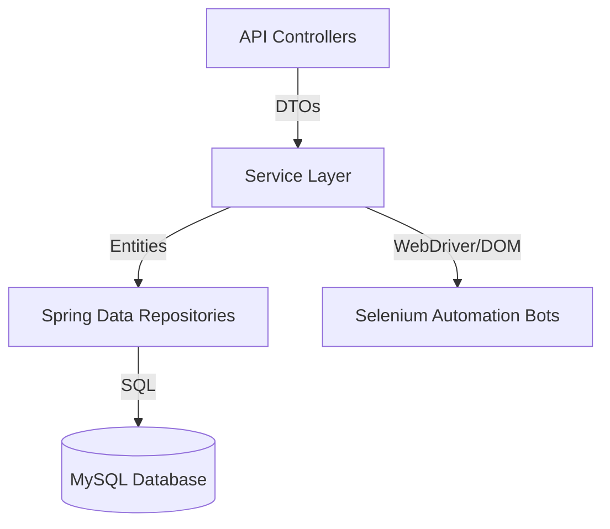

# Software Architecture Skills

This document evaluates the system architecture, design paradigms, and structural trade-offs implemented in this repository.

---

## 1. N-Tier Layered Architecture
* **Confidence Level**: 95% (Expert)
* **Description**: The system relies on a classic N-Tier Layered architectural design to decouple concerns:
  * **Presentation / API Layer**: Controllers expose endpoints using `@RestController` mapping methods, return DTOs, and handle validations.
  * **Business Logic Layer**: Services contain logic such as automation scheduling, parsing rules, and third-party API payloads.
  * **Data Access / Persistence Layer**: Repositories interact with relational tables via JPA.
  * **Cross-Cutting Concerns**: Config classes establish webdriver settings, custom mappers translate DTOs to entities, and custom exceptions standardize errors.

### Component Dependency Flow

### Code References
* **Layered Slicing Example**:
  * Presentation: [AgentController.java](file:///e:/AngularProjects/Job_Automation_with_Spring_boot/Linked_and_Naukri%20_jobs_Spring_boot_Automation_Services/src/main/java/com/jobbot/controller/AgentController.java)
  * Service Interface: [AiAgentService.java](file:///e:/AngularProjects/Job_Automation_with_Spring_boot/Linked_and_Naukri%20_jobs_Spring_boot_Automation_Services/src/main/java/com/jobbot/service/AiAgentService.java)
  * Service Implementation: [AiAgentServiceImpl.java](file:///e:/AngularProjects/Job_Automation_with_Spring_boot/Linked_and_Naukri%20_jobs_Spring_boot_Automation_Services/src/main/java/com/jobbot/service/impl/AiAgentServiceImpl.java)
  * Persistence Repository: [AiResponseRepository.java](file:///e:/AngularProjects/Job_Automation_with_Spring_boot/Linked_and_Naukri%20_jobs_Spring_boot_Automation_Services/src/main/java/com/jobbot/repository/AiResponseRepository.java)
  * Persistence Entity: [AiResponseEntity.java](file:///e:/AngularProjects/Job_Automation_with_Spring_boot/Linked_and_Naukri%20_jobs_Spring_boot_Automation_Services/src/main/java/com/jobbot/entity/AiResponseEntity.java)

---

## 2. Asynchronous API Integration vs. Blocking JDBC Architecture
* **Confidence Level**: 85% (Advanced)
* **Architectural Review**:
  * **WebClient Reactive Pipeline**: The application leverages `org.springframework.web.reactive.function.client.WebClient` to perform non-blocking HTTP requests to the external Gemini API. The controller layer returns `Mono<AiResponseDto>`.
  * **The Reactive-Blocking Hybrid Conflict**: Standard JDBC drivers (used by MySQL and Hibernate) are blocking by nature. The service implementation makes blocking database calls (`jobRepository.findAll()`, `aiResponseRepository.save()`) within the WebFlux reactive thread chain.
  * **Architectural Implication**: Running blocking JDBC operations directly on the Reactor Event Loop thread can cause thread pool starvation under heavy loads.
  * **Mitigation Recommendation**: Wrap blocking JPA queries in `Mono.fromCallable()` and run them on a dedicated thread pool using `Schedulers.boundedElastic()`.

### Code References
* **Reactive-Blocking Mix**:
  * See [AiAgentServiceImpl.java:L41-45](file:///e:/AngularProjects/Job_Automation_with_Spring_boot/Linked_and_Naukri%20_jobs_Spring_boot_Automation_Services/src/main/java/com/jobbot/service/impl/AiAgentServiceImpl.java#L41-L45) (Blocking databases read inside a method returning a `Mono` chain)

---

## 3. Automation Daemon & Scraping Architecture
* **Confidence Level**: 90% (Advanced)
* **Architectural Review**:
  * **Decoupled Driver Lifecycle**: In `NaukriJobBot`, the WebDriver is configured as a lazily initialized Spring `@Bean` injected via constructor. This ensures the service doesn't manage driver processes directly, adhering to dependency inversion.
  * **Self-Managed WebDriver Defect**: In contrast, `LinkedInLoginBot` instantiates ChromeDrivers directly (`driver = new ChromeDriver()`), coupling the process lifecycle directly to the execution method. This represents architectural debt that should be aligned with the `NaukriJobBot` pattern.

### Code References
* **Lazy WebDriver Injection (Decoupled)**:
  * See [NaukriJobBot.java:L76-78](file:///e:/AngularProjects/Job_Automation_with_Spring_boot/Linked_and_Naukri%20_jobs_Spring_boot_Automation_Services/src/main/java/com/jobbot/automation/NaukriJobBot.java#L76-L78)
* **Direct Instantiation (Coupled)**:
  * See [LinkedInLoginBot.java:L35](file:///e:/AngularProjects/Job_Automation_with_Spring_boot/Linked_and_Naukri%20_jobs_Spring_boot_Automation_Services/src/main/java/com/jobbot/automation/LinkedInLoginBot.java#L35)
